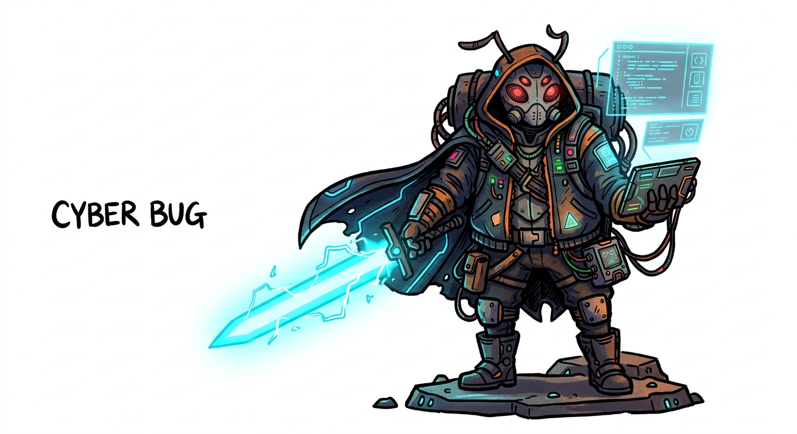
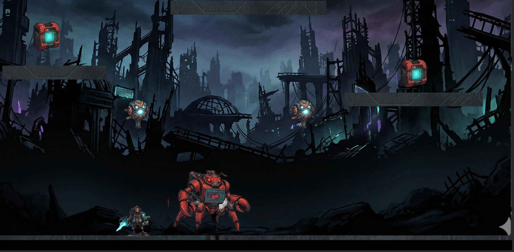
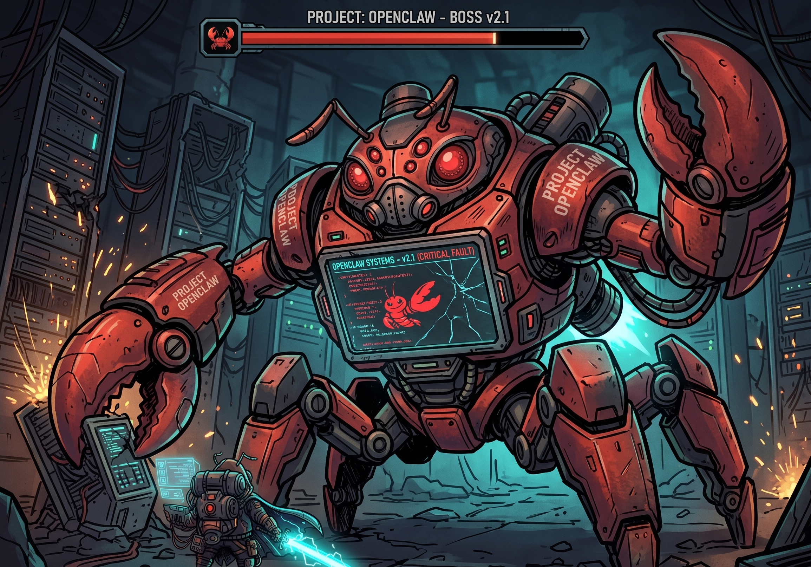

# Cyber Bug

  

Un platformer de acción hecho en **Godot 4** (demo para la meetup de **OpenClaw**). Pelea contra el boss “OpenClaw” y sobrevive el caos.

## Capturas

  

  

## Requisitos
- **Godot 4.x**

## Cómo correrlo
1. Abre Godot.
2. Importa el proyecto seleccionando `project.godot`.
3. Dale **Play**.

## Controles
- Movimiento: **Flechas** (o **A/D**)
- Saltar: **Arriba** (o **W**)
- Ataque: **Space** (o **Enter**)
- Down-attack (en el aire): **Abajo + Space**

## Estructura rápida
- `assets/` → sprites, SVGs, backgrounds, spritesheets
- `scenes/` → niveles y salas
- `scripts/` (si aplica) → lógica del juego

## Versionado (Godot)
- Se incluyen los archivos `*.import`.
- No se versiona `.godot/`.

## Créditos
- Engine: **Godot**
- Demo tooling: **OpenClaw**
